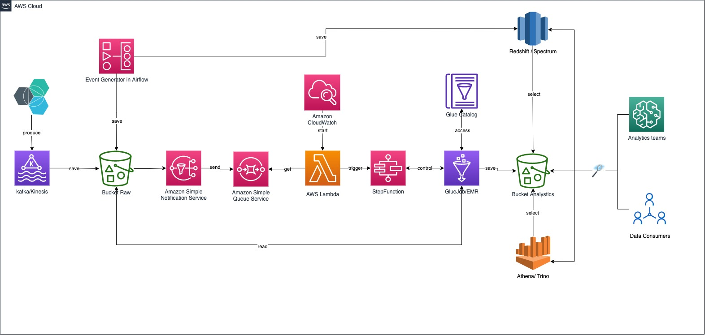

# Data Engineer - BikeIndex

This is an implementation of Global Saving Groups [study case](Data_Engineer_(m_f_d)_Case_study.pdf). The applications were developed in python and following the proposed architecture. The data consumed are from the documentation https://bikeindex.org/documentation/api_v3 . 

### 1) Data Ingestion

Event generator should use Redshift, however, there isn`t a docker image for that, thus I decided to use mongodb to simplify the challenge. Also the event generator **will save *a lot* of data** into run directory, but should be s3 following the proposed architecture (Event Generator).
```
docker pull mongo
```
```
docker run -p 27017:27017 mongo
```
```
python3 event_generator.py
```

### 2) Architecture



### 3) Timeline + Spark 

The third part should compose the ingestion into analytics bucket and will run on GlueJob or EMR. Create a bucket to run it, the data will be saved in this bucket, and the tables will be created into Glue Catalog.
```
export AWS_PROFILE="your_profile"
```

```
aws s3 mb your_bucket --region us-east-1
```

```
python3 bike_lake.py --bucket_name s3a://it-gsg-bike/
```
or to save local
```
python3 bike_lake.py
```